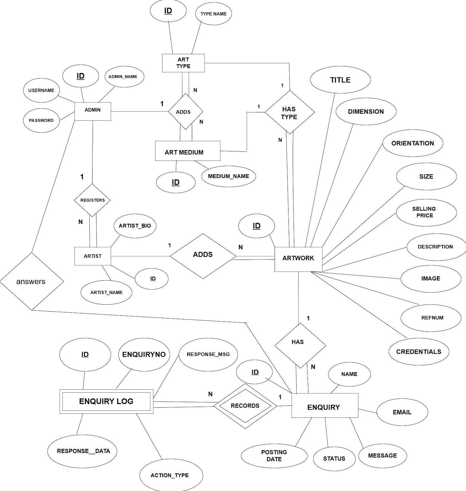
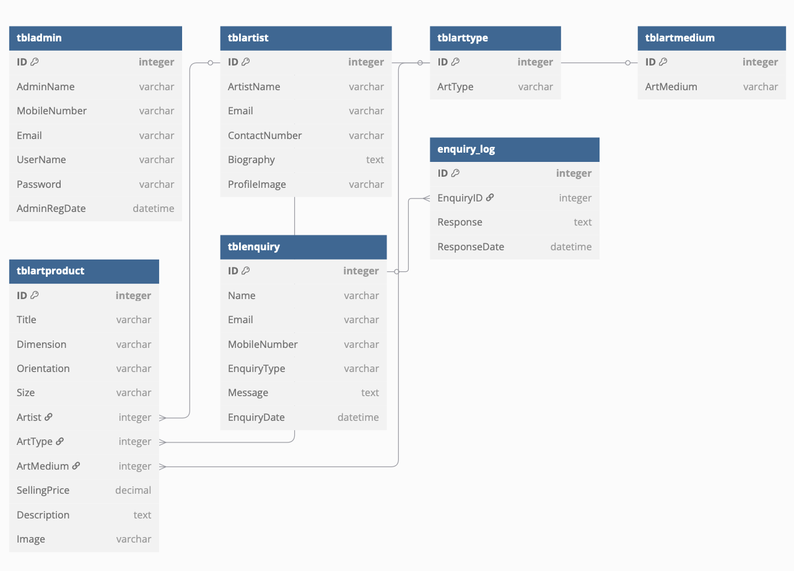
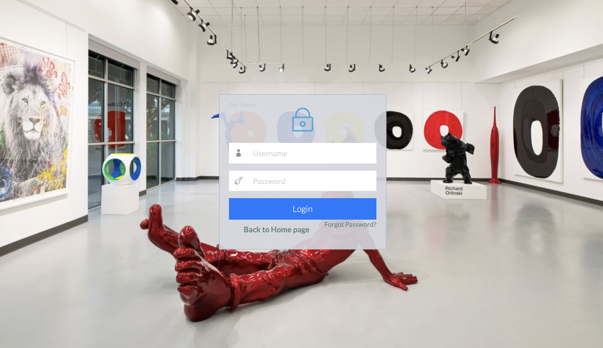
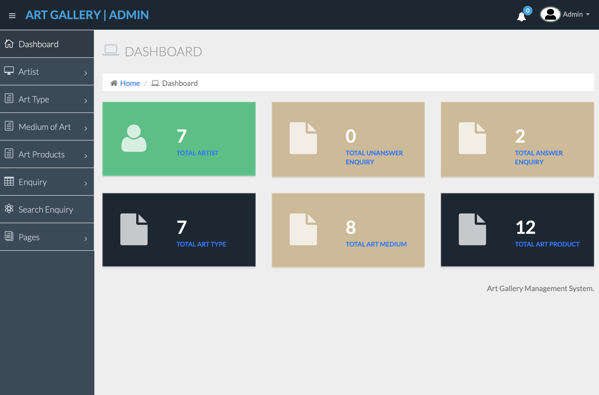

# Art-Gallery-Management-System
A web-based Art Gallery Management System built with PHP and MySQL that allows admins to manage artworks, artists, and customer enquiries. Includes user-friendly frontend, admin panel, and database features like triggers and views.

How to run the Art Gallery Management System (agms) Project :

 1. Download or Clone the Repository

- Option 1: Download the ZIP file and extract it.
- Option 2: Clone using Git:
  ```bash
  git clone https://github.com/aaisha077/Art-Gallery-Management-System.git

2. Copy Project Folder
 Copy the agms folder to your web server's root directory:

 For MAMP: /Applications/MAMP/htdocs (for macOS)      
 For XAMPP: C:/xampp/htdocs/        
 For WAMP: C:/wamp/www/        
 For LAMP: /var/www/html/         


3. Start Apache and MySQL
Open your MAMP(for macOS)/XAMPP/WAMP/LAMP control panel          
Start both Apache and MySQL      

4. Create the Database
Open phpMyAdmin: http://localhost/phpmyadmin         
Create a new database named agmsdb        

5. Import SQL Files
Go to the agms/SQL File/ folder  
Import agmsdb.sql – this sets up the database schema and sample data  
Then import agms_triggers_views.sql – this adds the required triggers and views  
(Ensure you import both files into the same agmsdb database in order)  

6. Run the Project
Visit in browser: http://localhost/agms  


Credential for Admin panel :   
URL: http://localhost/agms/admin   
Username: admin   
Password: admin123   


SQL Files Included
Located in the sql/ folder:
agmsdb.sql – Main database structure and initial data
agms_triggers_views.sql – Contains MySQL triggers and views for enhanced DB logic

Technologies Used:
PHP
MySQL
HTML, CSS, Bootstrap
phpMyAdmin


## 📸 Snapshots

### 🎨 ER Diagram (Version 2)


### 🧱 Database Schema


### 🏠 Home Page


### 🔐 Admin Login Page


### 📊 Admin Dashboard

